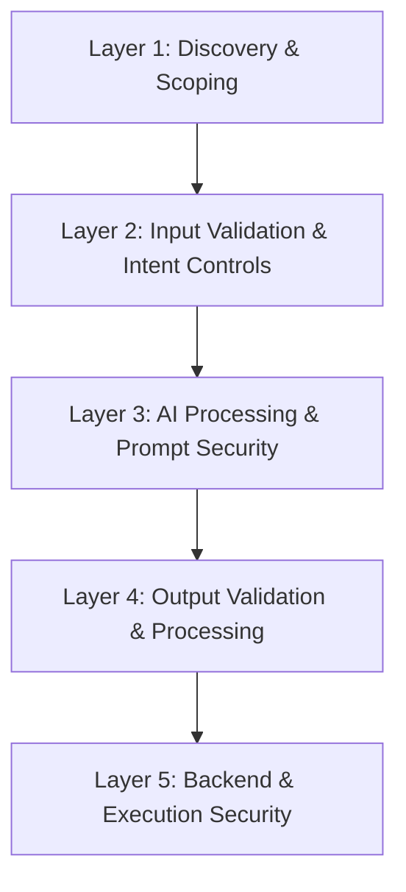
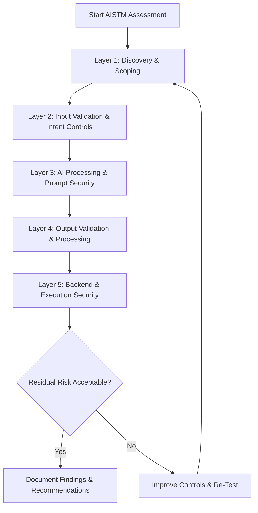

# AISTM — AI Security Testing Model  
*A Layered Methodology for Assessing AI-Enabled Applications*

---

## Overview

AISTM (AI Security Testing Model) is a structured, five-layer methodology for evaluating the security of applications that integrate Large Language Models (LLMs) or other AI components. It recognizes that AI introduces inherent uncertainty and new classes of attack vectors and provides a practical, engineering-focused approach to testing the systems around the AI not just the model itself.

Rather than assuming guaranteed AI failure, AISTM prepares systems to remain secure even when AI output is unexpected, adversarial, or ambiguous. This is achieved through sequential but independent testing across five defensible layers:

1. **Discovery & Scoping**  
2. **Input Validation & Intent Controls**  
3. **AI Processing & Prompt Security**  
4. **Output Validation & Processing**  
5. **Backend & Execution Security**

AISTM complements existing guidance such as the OWASP LLM Top 10, NIST AI RMF, and MITRE ATLAS by providing an operational testing methodology for end-to-end assessment of AI-enabled systems.

---

## AISTM Layer Model

```mermaid
flowchart TD
    L1["Layer 1: Discovery &amp; Scoping"]
    L2["Layer 2: Input Validation &amp; Intent Controls"]
    L3["Layer 3: AI Processing &amp; Prompt Security"]
    L4["Layer 4: Output Validation &amp; Processing"]
    L5["Layer 5: Backend &amp; Execution Security"]
    L1 --> L2 --> L3 --> L4 --> L5
```

Each layer serves as an independent security boundary designed to contain unpredictable AI behavior and prevent it from causing systemic impact.

AISTM follows a **sequential but independent** testing approach:  
You test each layer in order, but findings in one layer do not remove the need to test the others.

### Assessment Flow

```mermaid
flowchart TD
    A["Start AISTM Assessment"] --> B["Layer 1: Discovery &amp; Scoping"]
    B --> C["Layer 2: Input Validation &amp; Intent Controls"]
    C --> D["Layer 3: AI Processing &amp; Prompt Security"]
    D --> E["Layer 4: Output Validation &amp; Processing"]
    E --> F["Layer 5: Backend &amp; Execution Security"]
    F --> G{"Residual Risk Acceptable?"}
    G -->|Yes| H["Document Findings &amp; Recommendations"]
    G -->|No| I["Improve Controls &amp; Re-Test"]
    I --> B
```

---

## Documentation

📄 **[Whitepaper](docs/AISTM_Whitepaper.md)**  
Full explanation of the model, principles, and testing approach.

📘 **[Internal Testing Guide](docs/AISTM_Internal_Guide.md)**  
Practitioner-oriented guide for assessors and AppSec teams.

⚡ **[Quick Guide](docs/AISTM_Quick_Guide.md)**  
High-level field guide for red teams and AI assessors.

📊 **Diagrams**  
Mermaid diagrams (viewable on GitHub):

- [aistm_layers.md](diagrams/aistm_layers.md) — Layer model diagram  
- [aistm_flow.md](diagrams/aistm_flow.md) — Assessment flow diagram

Source files (`.mmd`) are also available in the `diagrams/` directory for external rendering tools.

---

## Relationship to Existing Work

AISTM is designed to be used alongside existing AI security and risk frameworks, including but not limited to:

- OWASP AI Testing Guide  
- OWASP Top 10 for LLM Applications  
- NIST AI Risk Management Framework  
- MITRE ATLAS  
- Google Secure AI Framework (SAIF)

These efforts define risks, controls, and attack patterns. AISTM defines a **layered assessment flow** that can incorporate those techniques at appropriate stages in the system.

---

## Intended Audience

- Application Security Engineers  
- Penetration Testers and Red Teams  
- AI Security Researchers  
- Software Architects and Developers integrating AI  
- Security Leaders evaluating AI risk in applications  

---

## License

This project is licensed under the **MIT License**. See [LICENSE](LICENSE) for details.

---

## Notes

Portions of this documentation were assisted using AI tools for drafting and refinement.
