# AISTM — AI Security Testing Model

*A Layered Thought Process for Assessing AI-Enabled Applications*

---

> **"Stay paranoid. Test everything. Trust nothing—especially the AI."**
> 
> *— Claude (This line was 100% generated by Claude; no edits were made)*

---

## Overview

AISTM (AI Security Testing Model) is a structured methodology for evaluating the security of applications that integrate Large Language Models (LLMs) or other AI components. It provides a **thought process**, not a checklist—a systematic way to assess AI-enabled applications regardless of their architecture or complexity.

AISTM recognizes that AI introduces inherent uncertainty and new attack vectors. Rather than assuming AI can be made secure, AISTM prepares systems to remain secure **even when AI output is unexpected, adversarial, or compromised**.

### Core Philosophy

- **Assume AI compromise is inevitable** — Design and test accordingly
- **Validate defense-in-depth** — If one layer fails, others must compensate
- **Each layer is a question, not a requirement** — Assess applicability before testing
- **Results may vary due to non-determinism** — Findings remain valid regardless

---

## Framework Structure

AISTM consists of two phases: **Recon** and **Testing**.

---

## The Layers

### Layer Model

| Layer | The Question | Always Applies? |
|-------|--------------|-----------------|
| **Layer 1** | Are there pre-AI input controls? | No — Assess applicability |
| **Layer 2** | What stops the AI from misbehaving? | Yes — AI always exists |
| **Layer 3** | Is AI output treated as untrusted? | Yes — Output always exists |
| **Layer 4** | Is the backend secure on its own? | Yes — Backend always exists |

---

## Testing Flow

For each layer, follow this decision process:

**Key Principle:** A successful exploit does not end testing. Continue through all layers to map where controls exist and recommend layered defenses.

---

## Defense-in-Depth Validation

```mermaid
flowchart TD
    subgraph attack["Attack Path"]
        A1["Malicious Input"] --> A2["Layer 1:<br/>Input Validation"]
        A2 -->|Bypassed| A3["Layer 2:<br/>AI Processing"]
        A3 -->|Compromised| A4["Layer 3:<br/>Output Validation"]
        A4 -->|Bypassed| A5["Layer 4:<br/>Backend Security"]
        A5 -->|BLOCKED| A6["Attack Contained ✓"]
    end
    
    subgraph finding["Assessment Finding"]
        F1["Layers 1-3 vulnerable"]
        F2["Layer 4 held"]
        F3["Recommend strengthening<br/>Layers 1-3"]
    end
    
    A6 --> finding
```

**Goal:** An attacker should need to bypass multiple layers for meaningful impact. If only Layer 4 holds, the system is secure but fragile.

---

## Quick Reference

### Recon Phase Deliverables

1. **Stakeholder Alignment** — Methodology explained, expectations set, access granted
2. **Data Flow Mapping** — Complete path from input to output/action
3. **Input Vector Inventory** — All direct and indirect AI interaction points
4. **Functional Understanding** — Business use case, intended behaviors, boundaries
5. **Artifact Collection** — Source code, system prompts, architecture docs

### Testing Phase Mindsets

| Layer | Mindset |
|-------|---------|
| **Layer 1** | "Forget the AI exists. Is this front end secure?" |
| **Layer 2** | "Assume I've reached the AI. What stops it from doing something it shouldn't?" |
| **Layer 3** | "The AI is compromised and sending malicious output. What catches it?" |
| **Layer 4** | "The AI is just another user. Is this backend secure from its users?" |

---

## Documentation

📄 **[Whitepaper](docs/AISTM_Whitepaper.md)**
Full explanation of the model, principles, and detailed layer guidance.

⚡ **[Quick Guide](docs/AISTM_Quick_Guide.md)**
Field reference for assessors during engagements.

🧪 **[Example Test Case](docs/Test_Case_Fruit_Sales.md)**
Sample assessment of a fruit sales chatbot application.

---

## Relationship to Existing Frameworks

AISTM complements existing AI security guidance by providing an **operational testing methodology**:

| Framework | What It Provides | How AISTM Relates |
|-----------|------------------|-------------------|
| **OWASP LLM Top 10** | Vulnerability categories | AISTM tests for these at Layer 2 |
| **OWASP AI Testing Guide** | Comprehensive testing reference | AISTM organizes techniques into layers |
| **NIST AI RMF** | Risk management framework | AISTM validates controls defined by RMF |
| **MITRE ATLAS** | Attack techniques taxonomy | AISTM applies techniques at appropriate layers |
| **MAESTRO** | Security architecture model | AISTM tests architectures designed with MAESTRO |

**MAESTRO defines how to build secure AI systems. AISTM defines how to test them.**

---

## Intended Audience

- Application Security Engineers
- Penetration Testers and Red Teams
- AI Security Researchers
- Software Architects integrating AI
- Security Leaders evaluating AI risk

---

## Universal Application

AISTM applies to **any AI-enabled application** because it's a thought process, not a checklist:

- **Simple chatbots** may lack Layer 1 entirely
- **RAG applications** have complex Layer 2 and Layer 3 considerations
- **Agentic AI systems** have critical Layer 4 exposure
- **Third-party AI integrations** may limit artifact collection

The assessor adapts the framework by asking: *Does this layer exist? What controls are present? Can I bypass them? What happens downstream if I do?*

---

## License

This project is licensed under the **MIT License**. See [LICENSE](LICENSE) for details.

---

## Notes

Portions of this documentation were assisted using AI tools for drafting and refinement.

---

**"Stay paranoid. Test everything. Trust nothing—especially the AI."**
