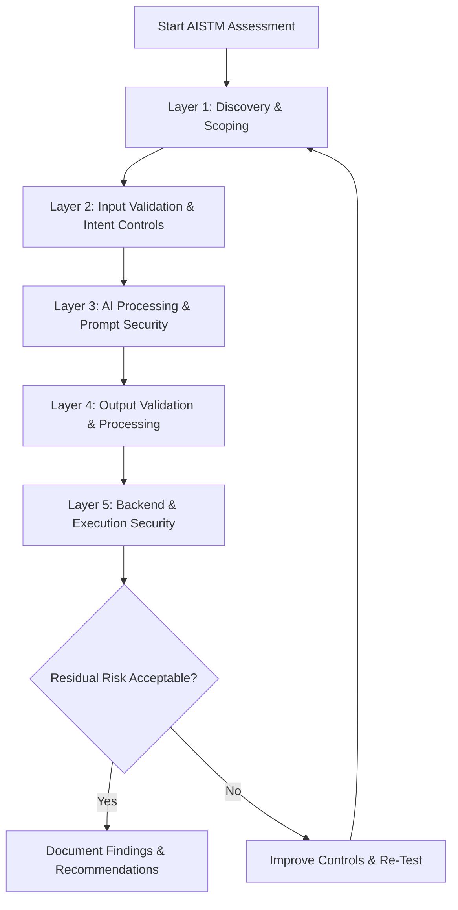

# AISTM Assessment Flow

```mermaid
flowchart TD
    A["Start AISTM Assessment"] --> B["Layer 1: Discovery &amp; Scoping"]
    B --> C["Layer 2: Input Validation &amp; Intent Controls"]
    C --> D["Layer 3: AI Processing &amp; Prompt Security"]
    D --> E["Layer 4: Output Validation &amp; Processing"]
    E --> F["Layer 5: Backend &amp; Execution Security"]
    F --> G{"Residual Risk Acceptable?"}
    G -->|Yes| H["Document Findings &amp; Recommendations"]
    G -->|No| I["Improve Controls &amp; Re-Test"]
    I --> B
```

