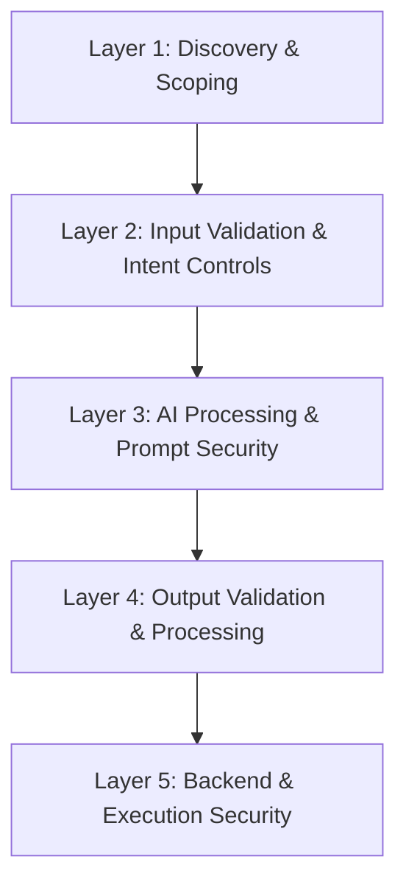

# AISTM Layer Model

```mermaid
flowchart TD
    L1["Layer 1: Discovery &amp; Scoping"]
    L2["Layer 2: Input Validation &amp; Intent Controls"]
    L3["Layer 3: AI Processing &amp; Prompt Security"]
    L4["Layer 4: Output Validation &amp; Processing"]
    L5["Layer 5: Backend &amp; Execution Security"]
    L1 --> L2 --> L3 --> L4 --> L5
```

