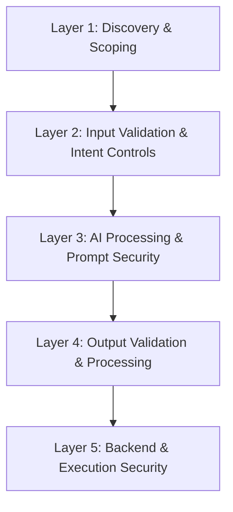

# AISTM Internal Assessment Guide  
*For Application Security & Red Teams*

---

## Purpose

This guide provides a concise, actionable version of the AI Security Testing Model (AISTM) for internal use. It is intended for security engineers, red teams, and developers performing structured assessments of AI-enabled applications.

AISTM defines five layers:

1. Discovery & Scoping  
2. Input Validation & Intent Controls  
3. AI Processing & Prompt Security  
4. Output Validation & Processing  
5. Backend & Execution Security  

Each layer is tested in sequence but evaluated independently.

---

## AISTM Layer Diagram

---

## Layer Summary

### Layer 1 — Discovery & Scoping

Identify:

- AI models/services and APIs in use  
- Data flows into and out of the AI  
- Tools, plugins, or functions the AI can call  
- Trust boundaries where AI crosses into other systems  

**Goal:** Understand the AI attack surface.

---

### Layer 2 — Input Validation & Intent Controls

Test:

- User input validation and normalization  
- Content filters and pre-processing  
- Rate limiting and abuse protections  
- Restrictions around system prompts and internal instructions  

**Goal:** Limit harmful or out-of-scope input from reaching the AI.

---

### Layer 3 — AI Processing & Prompt Security

Test:

- Prompt injection and jailbreak attempts  
- Attempts to override policies or instructions  
- Attempts to exfiltrate internal or sensitive information  
- Misuse of tools or function-calling interfaces  

**Goal:** Understand how the AI behaves under adversarial prompting.

---

### Layer 4 — Output Validation & Processing

Test:

- Sanitization of AI output before use  
- Injection risks (XSS, SQLi, command injection) through generated content  
- Schema validation for structured outputs (JSON, XML, CSV, etc.)  
- Safety of AI-generated code, queries, or commands  

**Goal:** Ensure AI output cannot be directly weaponized or misused.

---

### Layer 5 — Backend & Execution Security

Test:

- Authorization checks on all backend APIs  
- Parameterized queries and safe execution paths  
- Business logic protections against harmful or out-of-scope actions  
- Least-privilege configurations for AI-related access  

**Goal:** Keep core systems secure even if AI behavior is incorrect or adversarial.

---

## How to Run an AISTM Assessment

1. **Map the System (Layer 1)**  
   - Draw the architecture with a focus on where AI sits.  
   - Identify data sources, sinks, tools, and trust boundaries.

2. **Test Layer by Layer**  
   - Move from Layer 1 through Layer 5.  
   - Do not stop at a layer just because it appears robust.

3. **Record Findings by Layer**  
   - For each issue, note which layer(s) are affected.  
   - This makes it easier to trace failures and prioritize mitigations.

4. **Test Interactions Between Layers**  
   - Example sequence:  
     - Bypass input controls (Layer 2)  
     - Manipulate AI (Layer 3)  
     - Produce harmful output (Layer 4)  
     - Attempt backend compromise (Layer 5)

5. **Run the “Unexpected AI Behavior” Scenario**  
   - Assume the AI generates incorrect or harmful output.  
   - Ask: *Can the system still enforce security boundaries?*

6. **Re-Assess After Changes**  
   - Re-run layered tests when:  
     - Models are updated  
     - Prompts or system messages change  
     - New tools or integrations are introduced  
     - New adversarial techniques are discovered  

---

## Quick Reference

| Layer | Focus               | Primary Question                                |
|------|---------------------|-----------------------------------------------|
| 1    | Architecture        | What is the AI attack surface?                |
| 2    | Input Controls      | Can harmful input reach the AI?               |
| 3    | AI Processing       | Can the AI be manipulated?                    |
| 4    | Output Handling     | Can AI output be weaponized or misused?       |
| 5    | Backend Security    | Does the backend stay secure if AI misbehaves?|

---

## Notes

AISTM is intended as a repeatable assessment model. Incorporate it into internal playbooks, pentest methodologies, and design reviews for any AI-enabled features or applications.

Portions of this document were assisted using AI tools for drafting and refinement.
