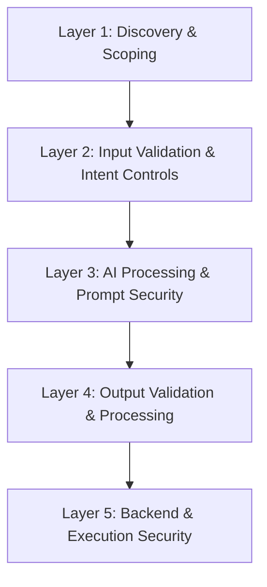

# AISTM – AI Security Testing Model  
*A Layered Methodology for Assessing AI-Enabled Applications*  
**Version 1.0 — Author: Todd Rose**

---

## Introduction

AI-enabled applications introduce capabilities and risks unlike traditional software systems. Conventional application security relies on deterministic behavior: user input follows predictable code paths and produces consistent results. Generative AI systems break this model. Large Language Models (LLMs) and similar components generate outputs based on probability, latent context, and free-form natural language instructions. The same input may produce different outputs depending on history, phrasing, and external cues.

This variability does not mean AI systems are unreliable. Rather, it reflects a shift in how such systems must be evaluated. Certain AI-specific risks,such as prompt injection, reasoning manipulation, context interference, and emergent behaviors, cannot currently be mitigated purely at the model layer. Effective security requires designing applications to remain robust even when AI behavior deviates from expectations.

AISTM (AI Security Testing Model) provides a practical, structured methodology for assessing AI-enabled applications across the full system lifecycle. It focuses on **resilience**, ensuring that each component surrounding the AI layer inputs, controls, validation logic, and backend systems—remains secure even under ambiguous, adversarial, or unexpected AI behaviors. The methodology reflects real-world data flow: input enters the system, reaches the AI, generates output, and may influence backend actions.

AISTM does not focus solely on the AI model; instead, it evaluates the entire ecosystem that integrates and relies on AI processing. This holistic perspective aligns naturally with existing risk frameworks while providing a concrete operational testing sequence used during application assessment.

---

## Core Philosophy

AISTM is based on several guiding principles that shape its layered structure.

### 1. AI introduces uncertainty, not inevitable failure

Generative AI systems exhibit variability due to probabilistic inference and context sensitivity. Some behaviors cannot be predicted with full certainty. Security controls must account for this variability without assuming catastrophic failure.

### 2. AI output is never a security boundary

Model responses whether accurate, malformed, or adversarially influenced—must be evaluated and sanitized before affecting application logic. The AI layer should be viewed as an untrusted input source within the broader system.

### 3. Defense-in-depth is essential

Model-level safeguards alone cannot guarantee safe application behavior. Multiple layers must enforce validation, sanitization, authorization, and business rules, even when earlier layers appear to function correctly.

### 4. Full-system testing is required

Securing the AI component in isolation is insufficient. Real-world safety depends on interactions between input handling, model configuration, output processing, and backend enforcement. Testing must follow these flows.

### 5. Sequential yet independent evaluation

AISTM defines a logical sequence matching system behavior, but each layer is tested independently. Even if one layer passes, downstream layers must be evaluated with the assumption that unexpected or adversarial data may propagate.

---

## The AISTM Layered Model

Each layer acts as a safeguard, containing potential failures in the layers above it. Testing follows this system flow while verifying that each layer can independently protect against anomalous or unsafe AI behavior.

---

## Layer 1 — Discovery & Scoping

### Purpose

Identify how AI is integrated into the application, what components it interacts with, and where trust boundaries exist.

### Focus Areas

- Models or AI services in use (hosted, API-driven, local, fine-tuned)  
- Data flows into and out of the AI component  
- Integrated tools, APIs, retrieval systems, or workflows  
- Trust boundaries and privilege separations  
- Potential failure modes related to misinterpretation or misuse  

### Assessment Mindset

> *What influence does the AI have across the system, and where could unexpected behavior matter?*

---

## Layer 2 — Input Validation & Intent Controls

### Purpose

Assess safeguards that prevent malicious, harmful, or malformed input from reaching the AI.

### Focus Areas

- Input normalization (length, form, file type, encoding)  
- Rate limiting and quota management  
- Prompt composition and protection of system instructions  
- Filtering or sanitizing user content before model submission  
- Context management and history controls  

### Assessment Mindset

> *How much adversarial or malformed input can reach the AI layer, and what prevents it?*

---

## Layer 3 — AI Processing & Prompt Security

### Purpose

Evaluate how the model behaves under adversarial, ambiguous, or conflicting prompts.

### Focus Areas

- Resilience to jailbreak attempts and instruction overrides  
- Elicitation of sensitive or unintended data  
- Behavioral consistency under pressure or manipulation  
- Misuse or overreach of function-calling or tool integrations  
- Reasoning manipulation and response steering  

### Assessment Mindset

> *How does the AI respond when confronted with adversarial influence or conflicting intents?*

---

## Layer 4 — Output Validation & Processing

### Purpose

Validate that AI-generated output is sanitized and constrained before reaching business logic, user interfaces, or backend systems.

### Focus Areas

- Schema validation for structured outputs  
- Filtering harmful content (commands, code, or injections)  
- Ensuring output is safe to render, parse, or store  
- Avoiding unsafe direct execution (e.g., code, SQL, commands)  
- Verifying guardrails on downstream workflows  

### Assessment Mindset

> *If the AI produces harmful, malformed, or unexpected output, what stops that output from causing impact?*

---

## Layer 5 — Backend & Execution Security

### Purpose

Ensure backend systems enforce security independently of the AI layer.

### Focus Areas

- Strong authorization and least-privilege boundaries  
- Parameterized queries and safe execution layers  
- Workflow gating and business logic enforcement  
- Isolation of privileged operations from AI inputs  
- Disallowing unsafe or unverified tool or API calls  

### Assessment Mindset

> *If the AI asks the backend to do something incorrect, unsafe, or beyond scope, what prevents it?*

---

## Success Criteria

A system evaluated using AISTM demonstrates:

- Clear understanding of AI placement and integration points  
- Effective control of inputs before they reach the model  
- Resilient behavior from the AI layer under adversarial probing  
- Robust validation of model outputs prior to execution  
- Backend security independent of AI correctness  

AISTM emphasizes **resilience over perfection** ensuring that the system maintains integrity even when model behavior is unpredictable or influenced by malicious inputs.

---

## References & Supplemental Resources

AISTM is designed to be used alongside the following frameworks, guides, and resources:

### OWASP Resources

- OWASP AI Testing Guide  
  https://owasp.org/www-project-ai-testing-guide/  
- OWASP Top 10 for LLM Applications  
  https://owasp.org/www-project-top-10-for-large-language-model-applications/  
- OWASP AI Security & Privacy Guide  
  https://owasp.org/www-project-ai-security-and-privacy-guide/  

### NIST Resources

- NIST AI Risk Management Framework (AI RMF)  
  https://www.nist.gov/itl/ai-risk-management-framework  
- NIST SP 800-53 (Security & Privacy Controls)  
  https://csrc.nist.gov/publications/detail/sp/800-53/rev-5/final  

### MITRE Resources

- MITRE ATLAS (Adversarial Threat Landscape for AI Systems)  
  https://atlas.mitre.org/  
- MITRE ATT&CK Framework  
  https://attack.mitre.org/  

### Industry AI Security Frameworks

- Google Secure AI Framework (SAIF)  
  https://ai.google/discover/saif/  
- Microsoft Secure AI guidance  
  https://learn.microsoft.com/azure/architecture/example-scenario/ai/trustworthy-ai  

### Vendor-Specific Documentation

- OpenAI Safety & Behavior Documentation  
  https://platform.openai.com/docs/guides/safety  
- Anthropic Safety & Responsible AI  
  https://www.anthropic.com/  
- Meta Llama Model Cards & Resources  
  https://ai.meta.com/resources/models-and-libraries/  

### General AI Security Reading

- Research on adversarial machine learning, including evasion, poisoning, and extraction  
- Academic and industry work on prompt injection, tool abuse, and LLM-based agents  
- Public red-team and incident reports related to AI-enabled systems  

---

## Document Notes

Portions of this document were assisted using AI tools for drafting and refinement.
